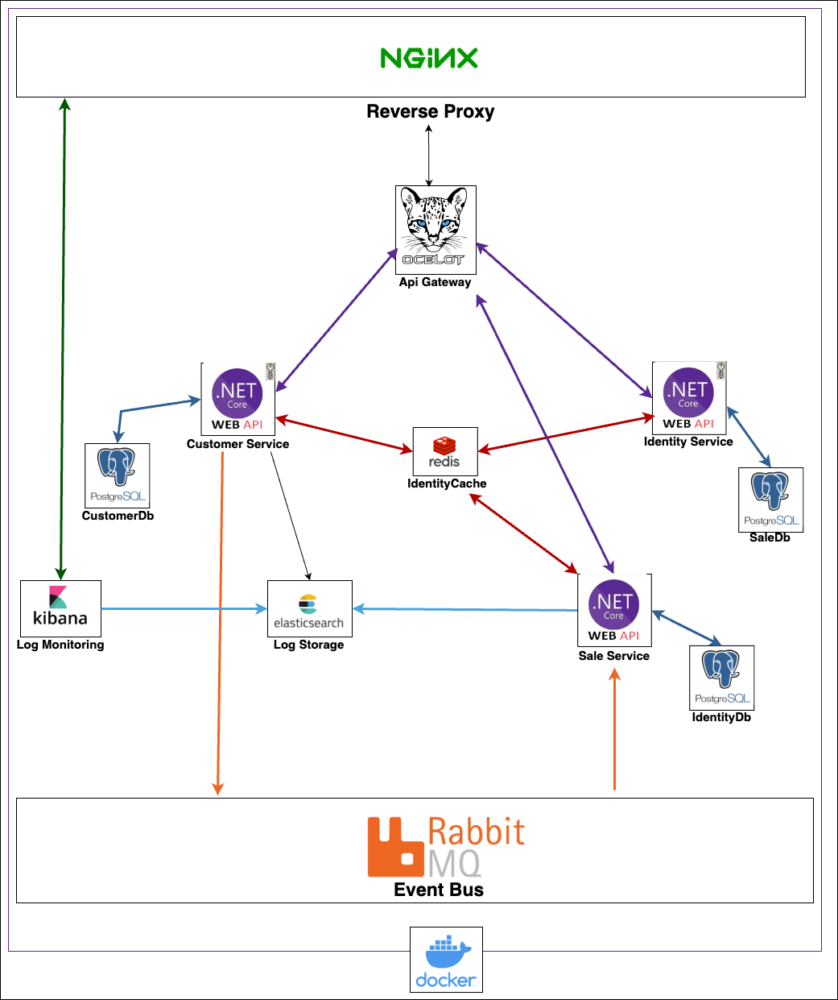

# .Net 8 - Docker - Nginx -Elasticsearch - Kibana - Ocelot - RabbitMq - Postgresql - Entity Framework

https://www.youtube.com/watch?v=qiFnLOjG_2s



# Prerequisites
.NET 8.0 Runtime

Docker structure is being established...
  # BackEnd:
   To start up the Api and the database
   
   ```ruby
   docker-compose build
   ```
   ```ruby
   docker-compose up
   ``` 
  
  # For Database Migration:
  ### 1. To create tables in the identity database.In the terminal go to the directory.
  
  ```ruby
  src/Services/IdentityService/IdentityService.Api
  ```   
  
  Run following code in Package Manager Console
  ```ruby
  Update-Database -Context IdentityServiceDbContext
  ```
  Or 

  Run following code in 
  ```ruby
  dotnet ef database update --context IdentityServiceDbContext
  ```
  ### 2. To create tables in the customer database.In the terminal go to the directory.
  
  ```ruby
  src/Services/CustomerService/CustomerService.Api
  ```   
  
  Run following code in Package Manager Console
  ```ruby
  Update-Database -Context CustomerServiceDbContext
  ```
  Or 

  Run following code in 
  ```ruby
  dotnet ef database update --context CustomerServiceDbContext
  ```
  ### 3. To create tables in the sale database.In the terminal go to the directory.
  
  ```ruby
  src/Services/SaleService/SaleService.Api
  ```   
  
  ### Second:
  Run following code in Package Manager Console
  ```ruby
  Update-Database -Context SaleServiceDbContext
  ```
  Or 

  Run following code in 
  ```ruby
  dotnet ef database update --context SaleServiceDbContext
  ```

  ## Technologies used:

* ASP.NET Core
* Entity Framework
* Swagger
* Mapper
* Serilog
* Rate Limit
* Ocelot
* Elasticsearch
* Kibana
* Nginx
* RabbitMQ

# Case Study - Microservice Project

This project is designed as a microservice architecture for **user management, customer management, and sales tracking**. Below are the expected features and evaluation criteria.

## Expected Features

### 1. User Management:
- Users should be able to log in to the system (**JWT authentication**).
- Manage user roles (**Admin, Sales Representative, etc.**).
- User information should be managed with **CRUD operations**.

### 2. Customer Management:
- Customers' information (**name, email, phone, company**) should be managed with **CRUD operations**.
- Notes can be added and edited for each customer.
- The customer list should be **sortable and filterable**.

### 3. Sales Tracking:
- Create a **sales pipeline** for potential sales (e.g., "New", "In Contact", "Negotiation", "Closed").
- Store the **date and notes** for each sales stage.
- Log the **timestamp** when the sales status changes.

### 4. Microservice Architecture:
- User management, customer management, and sales tracking should be designed as **separate microservices**.
- Microservices should communicate through an **API Gateway**.

### 5. Database:
- Design using **SQL or NoSQL database** preference.
- Each microservice should have **its own database**.

### 6. Testing & Documentation:
- Write **unit tests** for each service.
- Prepare API documentation (**Swagger** is recommended).

## Evaluation Criteria

1. **Code Quality**:  
   - Modularity, readability, and adherence to **DRY principles**.  
2. **Microservice Design**:  
   - Independence of services.  
3. **Database Design**:  
   - Performance and scalability.  
4. **Testing & Security**:  
   - Coverage of unit tests.  
   - Secure authentication using **JWT**.  
5. **Technical Documentation**:  
   - Detailed documentation for better understanding.  
6. **Performance & Usability**:  
   - API response times and efficiency.  

## Project Submission

- Version control the microservices using **Git** and upload them to a remote repository (**GitHub, GitLab, Bitbucket**).
- Containerize the microservices.
- Organize each microservice in **separate folders**.
- Use **Docker Compose** to orchestrate the entire system (`docker-compose.yml` file).
- Follow **clean code** and **secure coding** principles.
- API documentation should be accessible via **Swagger**.
- Preferably, provide a **video explanation** of your work and share its link.

